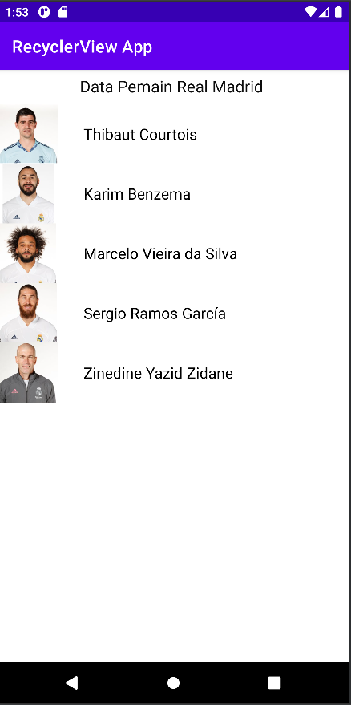
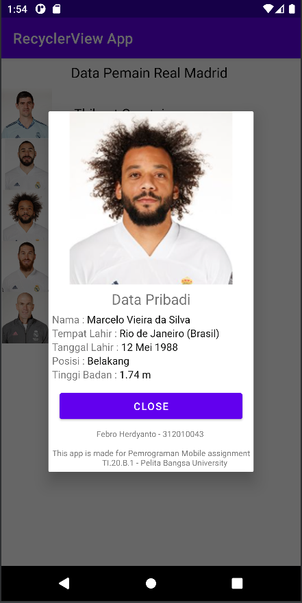

# Repository Name : UPBTI_PM_RecyclerViewApp

##### _Pemrograman Mobile - TI.20.B.1 - Universitas Pelita Bangsa_

    
    
    

Halo !
Perkenalkan saya Febro Herdyanto, mahasiswa Teknik Informatika dari Universitas Pelita Bangsa, Bekasi
Kali ini saya membuat repository **UPBTI_PM_RecyclerViewApp** guna untuk memenuhi Ujian Tengah Semester (UTS) mata kuliah Pemrograman Mobile yang diampu oleh Bapak Fajar Butsianto

Pada kesempatan kali ini membuat aplikasi android menggunakan Bahasa Pemrograman Kotlin dan menggunakan _software_ Android Studio. Aplikasi Android ini adalah RecyclerView,

### Apa itu Recycler View ?
Menurut _website : **android.com**_ , RecyclerView adalah ViewGroup yang berisi tampilan yang sesuai dengan data Anda. ViewGroup sendiri juga merupakan tampilan, jadi Anda menambahkan RecyclerView ke tata letak dengan cara yang sama seperti menambahkan elemen UI lainnya. Setiap elemen individual dalam daftar ditentukan oleh objek pemegang tampilan.

### Apa yang dibuat kali ini ?
Berdasarkan tutorial youtube dari Dosen Bapak Fajar Butsianto (https://www.youtube.com/@sufajarbutsianto671) untuk membuat sebuah aplikasi android sederhana, dimana didalam aplikasi tersebut menampilkan beberapa nama pemain sepak bola Real Madrid dalam sebuah list, kemudian ketika salah satu nama diklik maka akan menampilkan dialog / pop up dengan data pribadi lengkap pemain tersebut

### Bagaimana hasil dari aplikasi tersebut ?
Berikut adalah hasil dari aplikasi android sederhana tersebut

Tampilan Awal :  
 

Tampilan Diaglog / PopUp :  

## Thank You !

**Free Software, Hell Yeah!**
